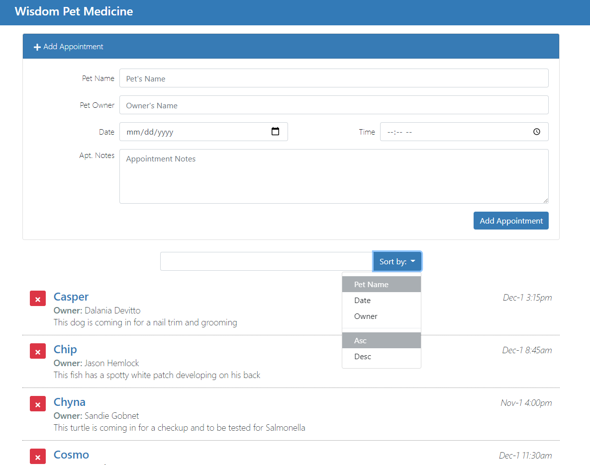

# React Appointment Scheduler

* [Ray Villalobos](https://raybo.org/) created this course and project for LinkedIn Learning. This is not an original project.

## Screenshot


## Description

A pet care appointment scheduler project made while learning React on LinkedIn Learning.
Made an interface that allows you to add appointments, modify or remove them, sort the list of appointments ascending or descending, and search for an appointment.

## Requirements

This project requires node.js and npm installed.
React Developer Tools chrome extension is helpful.
In terminal, run this to install all dependencies
```bash
npm i -s bootstrap react-icons lodash jquery popper.js moment react-moment
```
To start running, run this then go to localhost:3000 in browser
```bash
npm start
```

